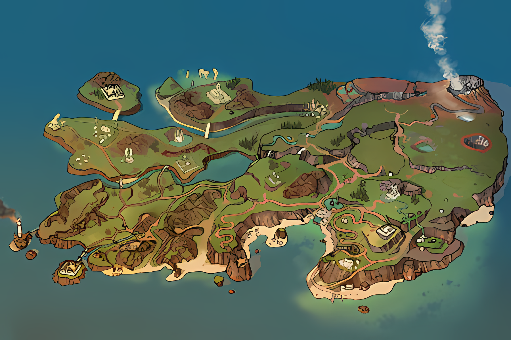

# 🌄MAPS

## 🗺 Разбор карт R2 Online

### Для точного сравнения с реальной картой, необходимо отразить (отзеркалить) карты внутри дирректории!

# 📜Меню: 

- [🗺️Разбор карт [Клиент]](%5BCLIENT%5D/)
- [🌎Разбор Колфорт и Демоджар [Клиент]](%5BCLIENT%5D/РАЗБОР%20КОЛФОРТ%20%2B%20ДЕМОДЖАР/)
- [🌐Разбор Колфорт и Демоджар [Сервер]](%5BSERVER%5D)
### Выгрузки:
- [🗂️[R3SD MAPDATA] Выгрузка [Клиент KOREA OFF 2023]](https://github.com/Aksel000/R2-Textures/tree/main/%5BMAPS%5D%20MAPS/%5BCLIENT%5D/R3SD%20MAPDATA%20%5BKOREA%202023%5D)
- - [📦[R3SD MAPDATA] Выгрузка в архиве [Клиент KOREA OFF 2023]](https://github.com/Aksel000/R2-Textures/tree/main/%5BMAPS%5D%20MAPS/%5BCLIENT%5D/R3SD%20MAPDATA%20ARCHIVE%20%5BKOREA%202023%5D)
- [🗂️[R3SD MAPDATA] Выгрузка [Клиент ACRA 2022]](https://github.com/Aksel000/R2-Textures/tree/main/%5BMAPS%5D%20MAPS/%5BCLIENT%5D/R3SD%20MAPDATA%20%5BACRA%202022%5D)
- - [📦[R3SD MAPDATA] Выгрузка в архиве [Клиент ACRA 2022]](https://github.com/Aksel000/R2-Textures/tree/main/%5BMAPS%5D%20MAPS/%5BCLIENT%5D/R3SD%20MAPDATA%20ARCHIVE%20%5BACRA%202022%5D)
- [📦[R3M WITH TEXTURES] Архив [KOREA 2023]](https://github.com/Aksel000/R2-Textures/tree/main/%5BMAPS%5D%20MAPS/%5BCLIENT%5D/R3M%20WITH%20TEXTURES%20%5BKOREA%202023%5D)
###
### Карта Колфорта:

